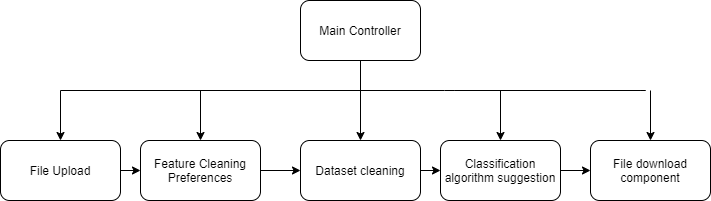
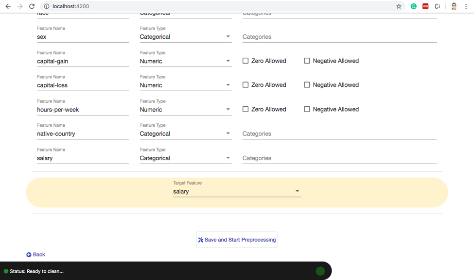
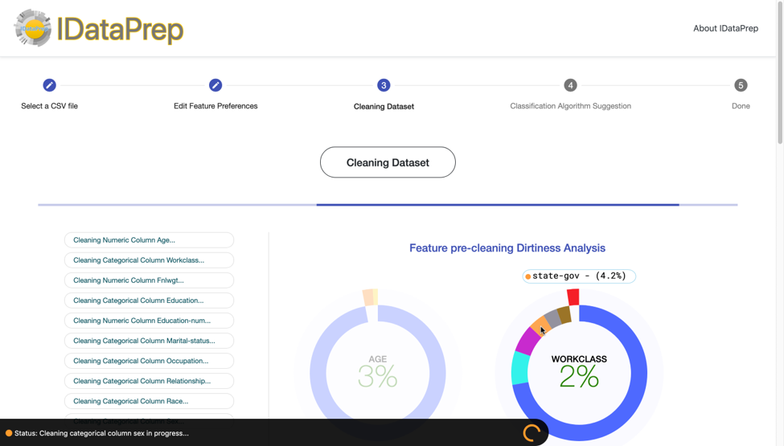
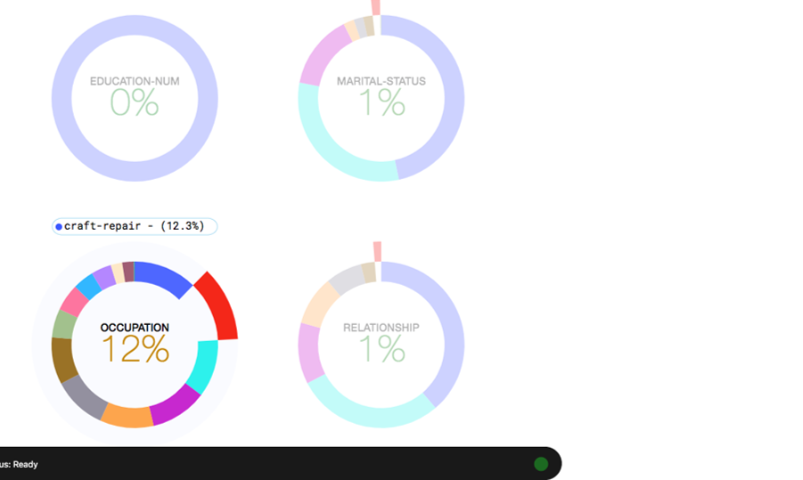
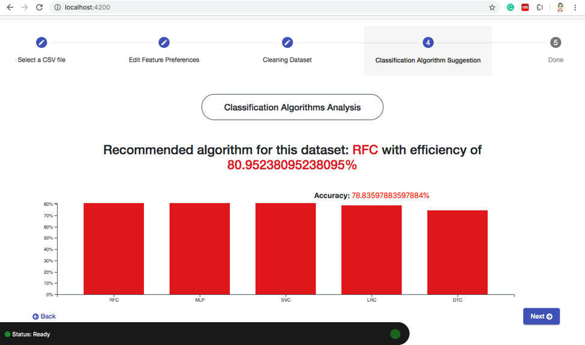

# IDataPrep

IDataPrep is an interactive web application which provides the user with clean dataset and visualization statistics at each step of cleaning the dataset. Data exploration, handling and its processing have emerged as the most reliable source of understanding and discovery of new facts. Under practical conditions, large datasets have lots of inconsistencies. For accurate data mining, it is required that the data be accurately preprocessed and cleaned. The quality of data is directly proportional to the success of machine learning algorithms applied on it. IDataPrep cleans any dataset consisting of categorical and numeric data and provides a suggestion to the user about the most efficient classifier that can be applied on the dataset in accordance with the target attribute provided by the user.

# Architecture
IDataPrep has mainly a front-end and a back-end associated with it. The front-end has been built using Angular 7 and the back-end has been developed using Python Flask. The main components of the web application are shown below:

The File Upload component accepts a valid csv dataset from the user and also allows the user to specify if the dataset has headers and if the preprocessing is for a classification process.

The Feature Cleaning Preferences component gives the user the option to treat the way each feature is cleaned. The user can also alter the name of each feature and label features without headers. The user is expected to enter the valid categories for categorical features in a comma separated list.

The Dataset Cleaning component visualizes each feature cleaning step and displays the dirtiness ratio of each feature along with other statistics.

The Classification Algorithm suggestion suggests to the user the classification algorithm to use based on the accuracy scored computed.

The File Download component lets the user to download the cleaned file as a csv.

# Sample screenshots of the application

# Instructions to run the project:

On the terminal:

Clone the repo https://github.com/sudarshan19943/IDataPrep

Set up Front-end:

1. cd /idataprep/frontend
2. npm install
3. npm start

Set up Backend:
1. cd /idataprep/backend
2. python3 app.py

Open browser: http://localhost:4200
